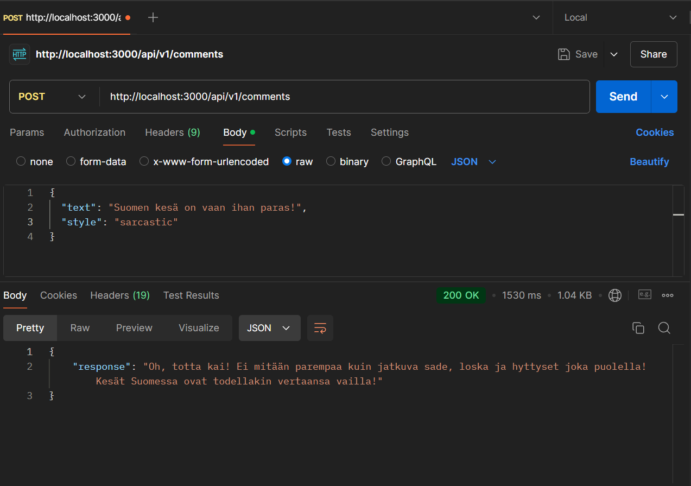

# Comment Generator

This project is a Comment Generator that automatically generates responses to YouTube comments using different styles (e.g., sarcastic, funny). It leverages the OpenAI API to produce responses based on given prompts.

### Example Responses

- **Prompt**: "Respond sarcastically to the comment: 'Suomen kesä on vaan ihan paras!'"
  - **Response**: "Oh, totta kai! Ei mitään parempaa kuin jatkuva sade, loska ja hyttyset joka puolella! Kesät Suomessa ovat todellakin vertaansa vailla!"



## Setup and Usage

1. Clone the repository.
2. Run `npm install` to install dependencies.
3. Start the server using `npm start`.
4. Use Postman or any API client to send a POST request to `http://localhost:3000/api/v1/comments`.
   - **Request Body**:
     ```json
     {
       "text": "Your comment here",
       "style": "sarcastic"
     }
     ```
